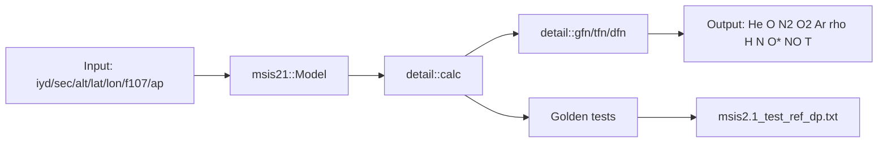

# NRLMSIS 2.1 C++20 Port

C++20 port and integration layer for NRLMSIS 2.1 with deterministic build presets and reference-parity validation.

## Architecture


## Build and Test
```bash
cmake --preset macos-clang-debug
cmake --build --preset macos-clang-debug
ctest --preset macos-clang-debug --output-on-failure
```

## Logging and Printing
- Runtime logging uses `spdlog`.
- Output formatting uses `fmt` where applicable.
