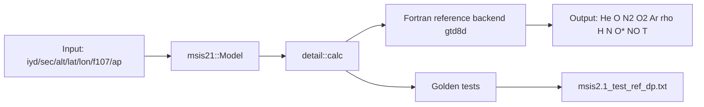

# NRLMSIS 2.1 C++20 Port

C++20 port and integration layer for NRLMSIS 2.1 with deterministic build presets and reference-parity validation.

## Architecture


## Build and Test
```bash
cmake --preset macos-clang-debug
cmake --build --preset macos-clang-debug
ctest --preset macos-clang-debug --output-on-failure
```

## Logging and Printing
- Runtime logging uses `spdlog`.
- CLI/output formatting uses `fmt`.
- Optional log level override:
```bash
MSIS21_LOG_LEVEL=debug ./build/macos-clang-debug/msis21_cli 70178 64800 400 0 0 12 150 150 4
```

## Examples
Single-point query:
```bash
./build/macos-clang-debug/msis21_cli 70178 64800 400 0 0 12 150 150 4
```

Density/AO profile from 2000 km to 250 km in g/cm^3:
```bash
./build/macos-clang-debug/msis21_profile_cli 2000 250 25
```
Columns:
- `alt_km`
- `rho_g_cm3` (total mass density)
- `o_g_cm3` (atomic oxygen partial mass density)
- `ao_g_cm3` (anomalous oxygen partial mass density)
- `status`

Generate a plot (similar workflow to DTM-style profile plots):
```bash
MPLCONFIGDIR=/tmp/mpl python3 examples/plot_msis_profile.py \
  --cli build/macos-clang-debug/msis21_profile_cli \
  --start-km 2000 --end-km 250 --step-km 25 \
  --output docs/figures/msis_profile_2000_250.png
```
